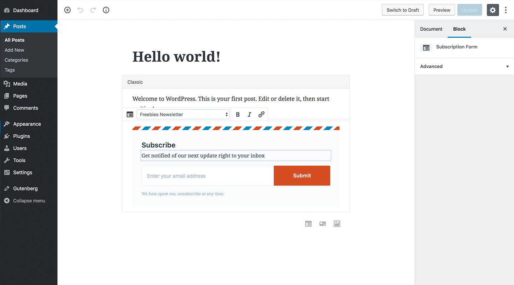

# WP Chimp

> Lean MailChimp subscription form plugin for WordPress

## Description

WP Chimp provides the ability to add a MailChimp subscription form to your post and page content and in the Widget area. The plugin also registers a custom [Gutenberg Block](https://wordpress.org/gutenberg/handbook/language/) allowing you to add and edit the subscription form in a much more intuitive way, which will not be possible when using the Shortcode.

This plugin focuses on simplicity, user experience, and speed. We ensure to provide seamless integration to MailChimp services, ease of use with an interface that complies with WordPress design guidelines, and that it would work at scale.

### Non-affiliation Disclaimer

MailChimp is a registered trademark of The Rocket Science Group. The name "MailChimp" used in this plugin is for identification and reference purposes only and does not imply any association with the trademark holder of their product brand, or any of its subsidiaries or its affiliates.

## Installation

### From within WordPress (Recommended)

1. Visit **Plugins > Add New**
2. Search for "WP Chimp" (without the quote, of course)
3. Click the **Install Now** button of WP Chimp on the search result
4. Activate it from the Plugins page.

### Manual Upload

1. Download the plugin `.zip` packcage from WordPress.org.
2. Visit **Plugins > Add New**
3. Click **Upload Plugin**
4. Click **Choose File**, and select the plugin `.zip` package you have just downloaded.
5. Click **Install Now**.
6. Activate it from the Plugins page.

### FTP Upload

If none of the above works, though this is going to be less convenient, you can install the plugin through FTP (File Transfer Protocol). To do so, you will need an FTP software installed on your computer, such as:

* [FileZilla](https://filezilla-project.org/) (Windows, macOS, Linux)
* [CyberDuck](https://cyberduck.io/) (Windows, macOS)

Then, connect to the FTP/SFTP server using the credentials given by your hosting provider.

1. Download the plugin `.zip` packcage from WordPress.org.
2. Unzip the archive and upload the `wp-chimp` folder into the plugin directory at `/wp-content/plugins/`.
3. Activate it from the **Plugins** page.

## Frequently Asked Questions

None, at the moment. Please ask :)

## Screenshots

### 1. The Settings page

### 2. The Gutenberg block in the Post editor

### 3. The subscription form rendered on the post

### 4. The subscription form editor in the Widget

### 5. The subscription form rendered on the Widget area

